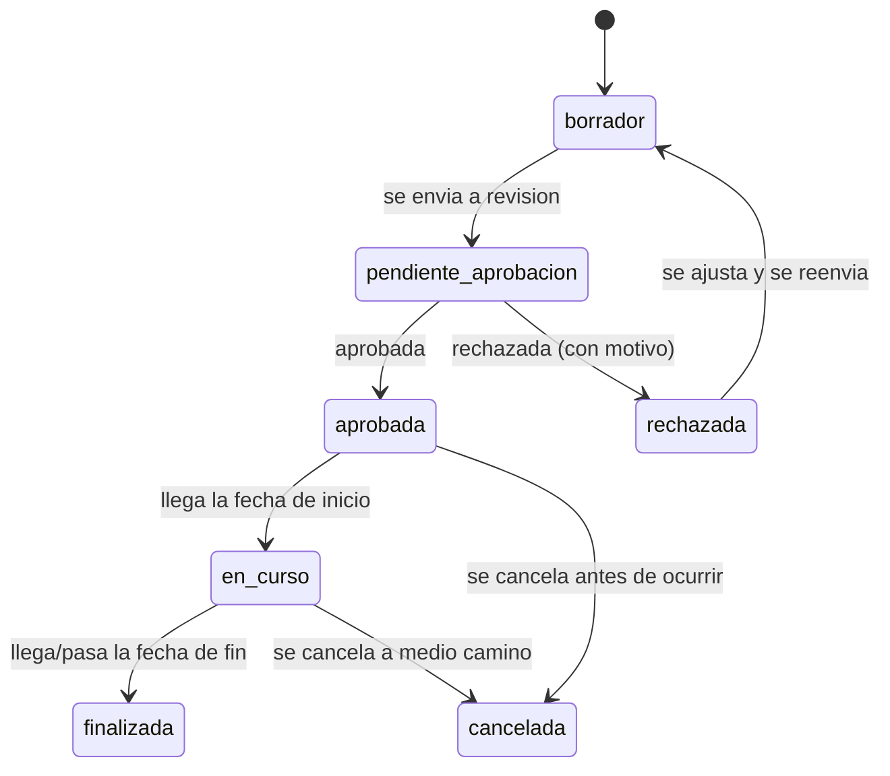

# Análisis: Campañas de Visitas Médicas (Oficinas, Eventos)

> **Documento de Diseño — Estado: Propuesto, solo análisis (no implementado).
> Queda en cola detrás de `DISENO-ZONA-HORARIA-SUCURSALES.md` (decidido
> 2026-09-06) — no arrancar sin que sucursales esté construido primero.**
> **Relacionado con:** [`DISENO-ZONA-HORARIA-SUCURSALES.md`](./DISENO-ZONA-HORARIA-SUCURSALES.md)
> (una campaña ocurre en un lugar que no es ninguna sucursal fija de la
> clínica, pero comparte la misma preocupación de "dónde y cuándo atiende
> cada doctor") y con `DISENO-PACIENTE-GLOBAL.md`/el escáner OCR de
> documentos (`escaner-documento.component.ts`) para el registro rápido de
> pacientes nuevos durante el evento.

---

## 1. Qué se pide

> "Elaborar campañas de visitas a lugares (oficinas, eventos), donde se debe
> programar la fecha, se reclutan los médicos que van a asistir, se prepara
> la campaña, se busca aprobación, y entra en el flujo de atención de cada
> paciente."

Es decir: la clínica organiza una salida a un lugar externo (la oficina de una
empresa cliente, una feria de salud, un evento comunitario) para atender
pacientes fuera de sus propias instalaciones. El ciclo de vida tiene 5 pasos
explícitos en el pedido, que se convierten en las 5 piezas de este diseño:

1. **Programar la fecha** (y el lugar).
2. **Reclutar los médicos** que van a asistir.
3. **Preparar la campaña** (logística, qué se va a ofrecer).
4. **Buscar aprobación** antes de confirmarla.
5. **Entra en el flujo de atención de cada paciente** — cada persona atendida
   en la campaña pasa por el mismo proceso clínico que cualquier paciente de
   consultorio (historia clínica, signos vitales, receta, laboratorio), no
   uno paralelo.

## 2. Por qué esto es distinto de una "sucursal"

Vale la pena distinguirlo del diseño de sucursales (documento relacionado),
porque a primera vista se parecen (ambos son "un lugar donde se atiende") pero
tienen naturaleza distinta:

| | Sucursal | Campaña |
|---|---|---|
| Duración | Permanente, recurrente | Puntual — un día o un rango corto de días |
| Horario | Patrón semanal fijo (`doctor_horarios`) | Se define una vez, para esa fecha específica |
| Ubicación | Dirección propia de la clínica | Dirección de un tercero (oficina cliente, salón de eventos) — no es un activo de la clínica |
| Quién atiende | Los doctores que ya trabajan ahí regularmente | Un grupo reclutado específicamente para esa salida, que puede incluir doctores que normalmente no comparten sucursal |
| Aprobación | No aplica (ya existe, es parte de la operación normal) | Requiere aprobación explícita antes de confirmarse |

**Conclusión de diseño:** una campaña **no es un tipo de sucursal**, es una
entidad propia (`campanas`), con su propia dirección de texto libre (no una
sucursal formal) y su propio ciclo de vida/aprobación. Donde sí se conectan:
una campaña debe indicar qué **sucursal la organiza** (administrativamente,
para saber qué clínica/sede es responsable — ver sección 5), y las citas que
resulten de ella deben poder integrarse al mismo sistema de citas ya existente
(ver sección 6).

## 3. Estado actual del sistema (para referencia)

Hoy no existe ningún concepto de campaña, evento, ni reclutamiento de
doctores. Lo relevante para este diseño:

```sql
-- doctores: pertenecen a una empresa, sin concepto de "disponible para eventos"
create table doctores (
    id uuid primary key, empresa_id uuid references empresas(id),
    usuario_id uuid, especialidad_id uuid, nombre text, ...
);

-- citas: requiere paciente_id y doctor_id, siempre con fecha/hora_inicio/hora_fin
create table citas (
    id uuid primary key, empresa_id uuid, paciente_id uuid not null,
    doctor_id uuid not null, fecha date not null,
    hora_inicio time not null, hora_fin time not null,
    estado text check (... 'pendiente','confirmada','atendida','cancelada',
                        'no_asistio','reagendar' ...),
    motivo text, observaciones text, log jsonb, ...
);
```

Todo el flujo clínico posterior a la cita (`historias_clinicas`,
`signos_vitales`, `recetas`, `ordenes_laboratorio`) ya cuelga de `cita_id`, no
de cómo se originó la cita — esto es una ventaja importante para este diseño
(ver sección 6): **no hace falta tocar ninguna de esas tablas ni pantallas**,
solo asegurarse de que una cita "de campaña" sea, en la base de datos, una
cita como cualquier otra.

## 4. Modelo de datos propuesto

```sql
create table campanas (
    id                  uuid primary key default gen_random_uuid(),
    empresa_id          uuid not null references empresas(id) on delete cascade,
    sucursal_id         uuid references sucursales(id),   -- sucursal organizadora (ver seccion 5)
    nombre              text not null,               -- ej. "Jornada de salud - Oficinas Acme"
    lugar               text not null,                -- direccion del lugar externo (texto libre)
    contacto_lugar      text,                         -- persona/telefono de contacto en el sitio, si aplica
    fecha_inicio        date not null,
    fecha_fin           date not null,                -- igual a fecha_inicio si es de un solo dia
    hora_inicio         time,
    hora_fin            time,
    descripcion         text,                          -- que se va a ofrecer (chequeos, vacunas, etc.)
    estado              text not null default 'borrador'
                        check (estado in (
                          'borrador', 'pendiente_aprobacion', 'aprobada',
                          'rechazada', 'en_curso', 'finalizada', 'cancelada'
                        )),
    aprobado_por        uuid references usuarios(id),
    fecha_aprobacion    timestamptz,
    motivo_rechazo      text,
    creado_por          uuid references usuarios(id),
    log                 jsonb not null default '[]'::jsonb,  -- mismo patron que citas.log
    created_at          timestamptz not null default now(),
    updated_at          timestamptz not null default now(),
    constraint chk_fechas_campana check (fecha_fin >= fecha_inicio)
);

-- Reclutamiento: que doctores estan invitados/confirmados para la campaña
create table campana_doctores (
    id            uuid primary key default gen_random_uuid(),
    campana_id    uuid not null references campanas(id) on delete cascade,
    doctor_id     uuid not null references doctores(id) on delete cascade,
    estado        text not null default 'invitado'
                  check (estado in ('invitado', 'confirmado', 'rechazado')),
    notas         text,
    created_at    timestamptz not null default now(),
    updated_at    timestamptz not null default now(),
    unique (campana_id, doctor_id)
);

-- citas: se agrega una referencia opcional a la campaña que la origino
alter table citas add column campana_id uuid references campanas(id);
```

**Por qué `campana_id` en `citas` es nullable y no un reemplazo de
`doctor_id`/`fecha`/etc.:** una cita de campaña sigue necesitando
paciente/doctor/fecha/hora igual que cualquier otra — `campana_id` solo marca
de dónde vino, para poder filtrar/reportar ("cuántos pacientes se atendieron
en esta campaña") sin inventar una tabla paralela de "atenciones de campaña".
Esto es exactamente lo que pide el punto 5 del planteamiento original: que la
campaña **entre** al flujo de atención existente, no que cree uno nuevo.

## 5. Sucursal organizadora vs. lugar de la campaña

`campanas.sucursal_id` indica qué sucursal de la clínica es la responsable
administrativa de la campaña (de dónde salen los doctores, quién la coordina),
**no** el lugar físico donde ocurre — ese es `campanas.lugar`, texto libre,
porque es una dirección de un tercero que no tiene sentido modelar como
sucursal formal (no es un activo permanente de la clínica, y normalmente no se
va a repetir con un horario recurrente). Si con el tiempo un mismo lugar
externo se vuelve una visita recurrente y formal, ahí sí valdría la pena
evaluar convertirlo en una sucursal — pero eso es una decisión posterior, no
parte de este diseño.

## 6. Integración con el flujo clínico existente

Este es el punto más importante del pedido original y, por diseño, el que
menos cambios requiere:

1. Durante la campaña, por cada persona atendida:
   - Si ya es paciente registrado (buscar por identificación, mismo flujo ya
     existente de "paciente global"), se reutiliza su registro.
   - Si es nuevo, se registra como paciente nuevo — **el escáner OCR de
     documentos ya implementado** (`app-escaner-documento`) es especialmente
     útil aquí: en un evento de alto volumen, escanear la cédula y confirmar
     los datos detectados es mucho más rápido que tipear todo a mano.
2. Se crea una `cita` normal (`paciente_id`, `doctor_id` del recruiting de la
   campaña, `fecha`/`hora_inicio`/`hora_fin` dentro de la ventana de la
   campaña, `campana_id` apuntando a la campaña).
3. De ahí en adelante, **todo sigue igual que hoy**: el doctor abre "Consulta
   Médica" sobre esa cita, registra signos vitales, historia clínica, receta,
   laboratorio — exactamente el mismo modal y los mismos endpoints que ya
   existen. No hace falta ninguna pantalla clínica nueva.
4. El historial del paciente (ver `DISENO-ZONA-HORARIA-SUCURSALES.md` sección
   4.2) sigue mostrando esa consulta igual que cualquier otra, sin importar
   que haya ocurrido en una campaña — mismo principio de "la ubicación no es
   una frontera de datos clínicos".

**Consecuencia práctica:** la UI de "atención durante la campaña" puede ser,
en su versión más simple, la misma pantalla de Citas de siempre, pre-filtrada
por `campana_id` — no requiere un flujo de consulta paralelo.

## 7. Ciclo de vida / estados de la campaña



- **`borrador`**: se está armando (fecha, lugar, descripción, reclutamiento en
  curso). Se puede editar libremente.
- **`pendiente_aprobacion`**: quien la organiza la marca como lista para
  revisión — a partir de aquí ya no se debería poder editar libremente sin
  volver a borrador (para que quien aprueba vea siempre la versión final).
- **`aprobada`** / **`rechazada`**: decisión de quien aprueba (ver sección 8).
- **`en_curso`**: dentro de la ventana `fecha_inicio`–`fecha_fin` — es cuando
  se pueden crear citas con `campana_id` apuntando a ella.
- **`finalizada`**: pasó la fecha; queda de solo lectura/reporte.
- **`cancelada`**: se puede cancelar en cualquier punto antes de finalizar.

## 8. Aprobación: quién y qué significa (pregunta abierta importante)

El pedido dice "se busca aprobación" sin especificar quién aprueba. Hay dos
lecturas posibles, y **no son excluyentes**:

- **Aprobación interna:** alguien con más autoridad dentro de la clínica
  (ej. `admin` de la empresa) debe aprobar la campaña antes de que se
  confirme — por presupuesto, logística, o simple control de que no cualquiera
  agende una salida sin autorización. Esto se modela naturalmente con el
  `estado`/`aprobado_por` ya propuesto en la sección 4, usando el mismo
  patrón de roles (`requireRol('admin')`) ya usado en otras partes del
  sistema (ej. horarios de doctores).
- **Aprobación externa:** el lugar visitado (la empresa cliente, el
  organizador del evento) también podría necesitar aprobar la propuesta de
  visita — pero eso ocurre típicamente **fuera** del sistema (por correo,
  llamada, contrato), y lo único que el sistema necesitaría es un lugar para
  dejar constancia de esa aprobación externa (ej. una nota o un archivo
  adjunto), no un flujo de aprobación en vivo con el tercero (no tiene cuenta
  en el sistema, similar en espíritu al laboratorio externo del diseño de
  QR — ver `DISENO-LABORATORIO-QR-EXTERNO.md`).

Este documento asume la **aprobación interna** como el flujo a construir
(sección 7), y deja la aprobación externa como un campo de texto/adjunto
informativo dentro de la campaña, no como un flujo interactivo — pero conviene
confirmarlo con el usuario antes de implementar (ver preguntas abiertas).

## 9. Reclutamiento de médicos

`campana_doctores` modela una relación tipo "invitación/RSVP": se invita a uno
o más doctores de la empresa (posiblemente de sucursales distintas — una
campaña puede juntar doctores que normalmente no coinciden), y cada uno
confirma o rechaza su participación. Solo los doctores en estado `confirmado`
deberían aparecer como opción al crear citas dentro de esa campaña (sección
6, paso 2).

**Cruce con el horario regular del doctor (importante, mismo espíritu que la
sección 4.1.b de `DISENO-ZONA-HORARIA-SUCURSALES.md`):** un doctor confirmado
en una campaña para una fecha/horario determinado debería quedar
efectivamente "ocupado" en su sucursal habitual durante esa ventana — si
alguien intenta agendarle una cita normal en su sucursal a la misma hora, el
sistema debería advertirlo o bloquearlo, igual que ya bloquea dos citas
superpuestas del mismo doctor hoy (`hayChoqueDeHorario`). Esto requiere que el
chequeo de choque de horario del doctor (ya existente) también considere sus
compromisos de campaña confirmados, no solo sus citas normales.

## 10. UI propuesta

- **Nueva sección de navegación "Campañas"** (visible para `admin`, y
  probablemente `doctor` en modo solo-lectura para ver a cuáles fue invitado).
- **Lista de campañas**: filtro por estado (mismo patrón de filtros ya usado
  en Citas/Pacientes), con badge de color por estado (mismo patrón de
  `badge-slate`/`badge-amber`/`badge-green`/`badge-red`/`badge-violet` ya
  establecido).
- **Crear/editar campaña**: formulario con los campos de la sección 4, más una
  sub-sección de reclutamiento (buscar y agregar doctores, ver su estado de
  confirmación).
- **Panel de aprobación**: para quien tiene el rol de aprobar, una vista de
  campañas en `pendiente_aprobacion` con botones Aprobar/Rechazar (rechazar
  pide motivo, mismo patrón de `confirm()`/formularios ya usado en el resto
  de la app).
- **Vista "Atención de campaña"**: reutiliza la pantalla de Citas ya
  existente, pre-filtrada por `campana_id` (nuevo query param, mismo patrón
  que los filtros por fecha/paciente/doctor ya usados para el deep-linking
  desde el Dashboard) — no es una pantalla nueva desde cero.

## 11. Hoja de ruta de implementación por fases

| Fase | Alcance | Depende de | Prioridad |
|---|---|---|---|
| **Fase 1** | Migración `campanas` + `campana_doctores` + `citas.campana_id`. CRUD básico de campañas en backend (crear, editar, listar, cambiar estado). | Fase 1 de `DISENO-ZONA-HORARIA-SUCURSALES.md` (para que `campanas.sucursal_id` referencie una tabla `sucursales` que ya existe) | Media |
| **Fase 2** | UI de lista + crear/editar campaña + reclutamiento de doctores (invitar, confirmar/rechazar). | Fase 1 | Media |
| **Fase 3** | Flujo de aprobación (panel de aprobación, transiciones de estado, notificación al creador cuando se aprueba/rechaza — mismo patrón "Fase 1 sin infraestructura nueva" ya propuesto en `DISENO-LABORATORIO-QR-EXTERNO.md` sección 6). | Fase 1 | Media |
| **Fase 4** | Vista "Atención de campaña" (Citas pre-filtrada por `campana_id`) + validar que crear una cita ahí exige que el doctor esté `confirmado` en `campana_doctores`. | Fase 1–2 | Media |
| **Fase 5** | Chequeo de choque: un doctor confirmado en una campaña no puede tener una cita normal superpuesta en su sucursal habitual, y viceversa (sección 9). | Fase 4, y `DISENO-ZONA-HORARIA-SUCURSALES.md` si ya está implementado | Baja/Media |
| **Fase 6** | Reportes de campaña (cuántos pacientes atendidos, por doctor, conversión de invitados a atendidos, etc.). | Fase 4 | Baja |

## 12. Preguntas abiertas para decisión del usuario

1. **¿Quién aprueba una campaña?** ¿Un rol específico (`admin`), o cualquier
   admin de la empresa organizadora? ¿Aplica también aprobación externa
   registrada en el sistema, o eso queda completamente fuera (sección 8)?
2. **¿Puede un paciente agendarse a sí mismo para una campaña, o siempre es el
   personal de la clínica quien registra en el sitio?** Afecta si hace falta
   algún tipo de "lista de pre-inscritos" antes del día del evento.
3. **¿La campaña tiene un límite de cupo** (máximo de pacientes a atender), o
   es abierta hasta que se acabe el tiempo/los doctores disponibles?
4. **¿Se factura/cobra distinto una atención de campaña** (ej. gratuita o con
   tarifa especial, patrocinada por la empresa visitada) vs. una consulta
   normal? Hoy el sistema no tiene módulo de facturación, así que esto
   quedaría fuera de alcance por ahora, pero vale la pena tenerlo en mente
   para no bloquear un futuro módulo de facturación.
5. ~~¿Esto depende de que `DISENO-ZONA-HORARIA-SUCURSALES.md` se implemente
   primero?~~ **Resuelto (2026-09-06): sí, sucursales va primero.** Aunque
   `campanas.sucursal_id` técnicamente podría quedar nullable y agregarse
   después, se decidió construir sucursales antes para no coordinar dos
   migraciones por separado. Este documento (campañas) queda en cola detrás
   de `DISENO-ZONA-HORARIA-SUCURSALES.md` — no arrancar su implementación
   hasta que sucursales esté construido (o al menos su Fase 1).

## 13. Fuera de alcance de este documento

- Facturación/cobro de la campaña (ver pregunta abierta #4).
- Logística de insumos/materiales físicos para el evento (más allá de un
  campo de texto libre `descripcion`) — si se necesita un inventario o
  checklist estructurado, es una mejora aparte.
- Portal para que el lugar visitado (la empresa cliente) vea/apruebe la
  campaña directamente en el sistema — se asume aprobación externa fuera del
  sistema (sección 8), no un portal nuevo.
