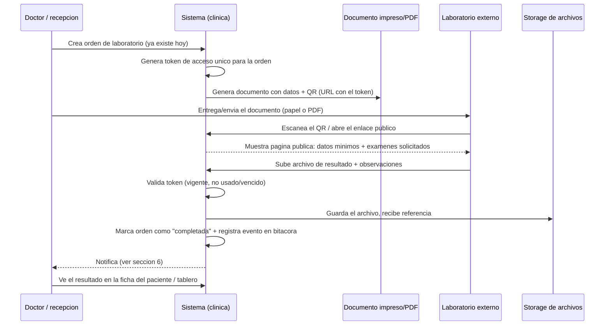

# Diseño: Órdenes de Laboratorio con QR y Carga de Resultados por Laboratorios Externos

> **Documento de Diseño — Estado: Propuesto, solo documentación (no implementado).**
> **Relacionado con:** [`DISENO-LABORATORIO.md`](./DISENO-LABORATORIO.md) (catálogo estructurado, aún no implementado),
> [`LABORATORIO.md`](./LABORATORIO.md) (módulo actualmente en producción) y
> [`MEJORAS-PROPUESTAS.md`](./MEJORAS-PROPUESTAS.md) secciones 5 y 6 (ya anticipaban esta necesidad).

---

## 1. Motivación / problema a resolver

Hoy el flujo de laboratorio termina en: el doctor crea la orden desde la cita, y **alguien del personal de la propia
clínica** captura los resultados a mano dentro del sistema (texto libre en `resultado`/`valor_referencia`). Cuando el
examen se realiza en un **laboratorio externo** — que no tiene ni tendrá cuenta en esta plataforma — no existe ninguna
forma de que ese laboratorio interactúe con la orden directamente: el resultado llega por teléfono, correo o papel, y
alguien de la clínica tiene que transcribirlo.

Se pide resolver esto así: la orden impresa/descargada lleva un **código QR**. Al escanearlo, el laboratorio destino
(cualquiera que sea, sin necesidad de credenciales ni cuenta) accede a una página pública específica de **esa orden**,
donde puede subir el resultado. Al subir, la orden pasa de `pendiente` a `completada` automáticamente y se notifica
al doctor/clínica.

## 2. Alcance de esta mejora

Cubre: generación del documento de orden con QR, acceso externo seguro de un solo propósito, carga de resultados
(archivo), actualización de estado, notificación y almacenamiento de archivos.

**No cubre** (fuera de alcance, ver sección 9): catálogo estructurado de exámenes con parámetros/rangos de
referencia, ni captura de resultados numéricos campo por campo — eso es lo que ya propone `DISENO-LABORATORIO.md`.
Esta mejora es compatible con el modelo actual en producción (`ordenes_laboratorio` + `orden_laboratorio_examenes`,
texto libre) y también con el modelo estructurado más grande si algún día se adopta, porque el acceso QR/externo
opera a nivel de **orden completa**, no de examen individual — no depende de cuál de los dos modelos de datos esté
por debajo.

## 3. Flujo propuesto end-to-end



Paso a paso:

1. Doctor/recepción crea la orden de laboratorio (flujo ya existente, sin cambios).
2. Al guardar la orden, el sistema genera un **token de acceso** único y aleatorio para esa orden específica.
3. Se genera el documento "Orden de laboratorio" para imprimir/descargar — extiende el mismo patrón ya usado para
   imprimir recetas (`imprimirReceta()` + `window.print()` sobre una plantilla dedicada), agregando:
   - Los datos que ya se imprimen hoy (clínica, paciente, doctor, exámenes solicitados).
   - Un **código QR** que codifica una URL pública: `https://<dominio-clinica>/laboratorio/orden/{token}`.
4. El personal entrega o envía la orden (impresa o en PDF) al laboratorio que elija — el sistema no necesita saber de
   antemano cuál es; cualquiera que reciba el papel/PDF puede usarlo.
5. El laboratorio escanea el QR (o abre el enlace) desde cualquier dispositivo, sin necesidad de una cuenta.
6. Se le presenta una página pública minimalista, de un solo propósito:
   - Nombre de la clínica, datos mínimos del paciente y del doctor solicitante, lista de exámenes pedidos.
   - Un formulario para subir uno o más archivos de resultado (PDF/imagen) y observaciones en texto libre.
   - Un campo simple "Nombre del laboratorio / responsable" — no es una cuenta, solo un dato de auditoría.
7. Al enviar, el backend:
   - Valida el token (existe, no venció, la orden no está cancelada).
   - Guarda el archivo en el storage elegido (ver sección 5).
   - Cambia `ordenes_laboratorio.estado` de `pendiente` a `completada`.
   - Registra el evento en una bitácora de la orden (mismo patrón ya usado en `citas.log`: jsonb array con
     fecha/origen/nota — ver migración `010_citas_log.sql`).
   - Dispara la notificación al doctor/clínica (ver sección 6).
   - Invalida o marca usado el token según lo que se decida (sección 4.3).
8. El doctor/clínica ve la orden como `completada` en el tablero y en la Consulta Médica, con el archivo disponible
   para ver/descargar, igual que si el propio personal lo hubiera subido.

## 4. Seguridad del acceso externo (el punto más delicado)

Este es el único punto de la aplicación donde alguien **sin login** puede escribir datos clínicos. Hay que tratarlo
con el mismo cuidado que un formulario público de internet, no como una pantalla interna más.

### 4.1 Token de acceso

No usar el `id` (UUID) de la orden como si fuera secreto: no fue diseñado como credencial, y termina apareciendo en
logs, historial del navegador, etc. Generar un **token dedicado**, aleatorio criptográfico (ej. 32 bytes con
`crypto.randomBytes(32).toString('base64url')`), en una columna nueva `ordenes_laboratorio.token_acceso`
(`unique`, indexada), distinta del `id`. El QR codifica una URL que usa el token, no el id.

### 4.2 Alcance del token

El token da acceso **solo** a: ver los datos mínimos de esa orden (nombre y edad del paciente — no toda su ficha —,
exámenes solicitados, datos de la clínica) y subir el/los archivo(s) de resultado + observaciones. No permite editar
al paciente, ver otras órdenes, ni acceder a ninguna otra parte del sistema. Se implementa como rutas públicas
separadas (ej. `/api/laboratorio-publico/:token`), sin pasar por `requireAuth`/`requireEmpresa`, con su propia
validación acotada al alcance descrito.

### 4.3 Expiración y reutilización (decisión abierta — ver sección 8)

- **Opción A (recomendada):** el token expira a los N días (ej. 30) de creada la orden, y deja de aceptar cargas una
  vez la orden pasa a `completada` — si hace falta corregir un resultado, lo hace el personal de la clínica desde el
  sistema normal (autenticado), no desde el enlace público, para no perder trazabilidad de quién corrigió qué.
- **Opción B:** token de un solo uso (se invalida apenas se sube un archivo).

Cualquiera de las dos evita que el enlace quede "abierto para siempre".

### 4.4 Limitar abuso

- *Rate limiting* por IP/token en las rutas públicas (evitar que alguien intente adivinar tokens o haga spam de
  subidas).
- Validar tipo de archivo (whitelist: PDF, JPG, PNG) y tamaño máximo (ej. 10–15 MB), tanto en frontend como backend.
- Registrar IP y user-agent de quien sube el archivo en la bitácora de la orden, como rastro mínimo de auditoría (no
  como identificación formal del laboratorio).

### 4.5 Privacidad de datos de salud

La página pública debe mostrar el mínimo necesario para que el laboratorio confirme que es la orden correcta (nombre
del paciente y exámenes), **no** el historial clínico completo, alergias, dirección, etc. Vale la pena confirmar si
aplica alguna normativa de Panamá sobre datos de salud antes de exponer cualquier información de un paciente a un
enlace sin autenticación — este documento no es asesoría legal, es una nota para confirmarlo antes de implementar.

## 5. Almacenamiento de archivos (storage)

Ya identificado como pendiente en `DISENO-LABORATORIO.md` (pregunta abierta #1) y en `MEJORAS-PROPUESTAS.md`
(sección 6). Esta mejora obliga a resolverlo ahora, porque el archivo lo sube alguien **de fuera de la clínica**, sin
que el sistema controle de antemano el tamaño o formato que va a mandar.

| Opción | Descripción | A favor | En contra |
|---|---|---|---|
| Base64 en PostgreSQL | Igual que avatares/logos hoy | Cero infraestructura nueva | Postgres no está pensado para archivos grandes/binarios; un PDF escaneado de varias páginas pesa varios MB, y ahora llega desde fuera de la clínica (menos control de calidad); infla backups, encarece el plan de Neon, ralentiza queries |
| Disco local del servidor | Guardar en el filesystem del backend | Simple de implementar | No sobrevive un redeploy/reinicio en la mayoría de hostings modernos; no escala a más de una instancia del backend |
| Almacenamiento de objetos compatible con S3 (AWS S3, Cloudflare R2, Backblaze B2) | Se sube al bucket, Postgres solo guarda la referencia (key/URL) | Hecho para esto: barato, duradero, sirve archivos grandes sin pasar por Node/Postgres, URLs firmadas con expiración para descarga segura | Requiere una cuenta/credenciales nuevas y algo de configuración inicial |

**Recomendación:** almacenamiento de objetos compatible con S3. Entre las opciones, **Cloudflare R2** tiene la mejor
relación costo/simplicidad para este tamaño de proyecto (sin costo de egreso, capa gratuita generosa, API compatible
con el SDK de S3 que ya es el estándar de facto). Postgres solo guarda metadata: nombre de archivo, tipo MIME,
tamaño, la *key* dentro del bucket (no la URL pública) y quién lo subió.

Flujo técnico sugerido para la subida desde el enlace público:

1. El navegador del laboratorio sube el archivo al backend (`POST /api/laboratorio-publico/:token/resultado`,
   `multipart/form-data`).
2. El backend valida token + tipo + tamaño, sube el archivo al bucket vía el SDK de S3/R2, y guarda solo la
   referencia en la tabla nueva (ver sección 7).
3. Para que el doctor/clínica vea o descargue el archivo después, el backend genera una **URL firmada de descarga**
   de corta duración (ej. 15 minutos) al momento de pedirla — nunca se expone la URL directa del bucket ni las
   credenciales de acceso.

## 6. Notificaciones al doctor / clínica

Hoy el sistema no tiene ningún mecanismo de notificaciones (ni email, ni push, ni panel de campanita) — hay que
decidir el punto de partida.

- **Fase 1 (mínima, sin infraestructura nueva):** extender el patrón ya existente del tablero ("Laboratorios
  pendientes") con una nueva distinción visual: marcar las órdenes que pasaron a `completada` recientemente y que el
  doctor/admin todavía no ha "visto" (columna nueva `vista_por_clinica boolean default false`, se marca `true` al
  abrir el detalle de la orden).
- **Fase 2 (email):** enviar un correo al doctor solicitante (o a un correo general de la clínica) cuando una orden
  pasa a `completada`, usando un servicio transaccional (Resend, SendGrid, Amazon SES). Requiere definir
  remitente/dominio verificado y confirmar que se captura el correo del doctor. Dado el volumen bajo esperado, no
  hace falta una cola de mensajería todavía — una llamada directa al enviar basta.
- **Fase 3 (opcional, a futuro):** push o WhatsApp — ya mencionado en `MEJORAS-PROPUESTAS.md` sección 5 como
  recordatorios de citas; se podría reutilizar la misma integración para avisos de resultados listos.

**Recomendación:** implementar la Fase 1 primero (no depende de infraestructura de correo externa) y evaluar la
Fase 2 cuando el volumen de órdenes lo amerite.

## 7. Cambios de modelo de datos propuestos

Extiende el modelo **ya implementado en producción** (migración `007_laboratorio.sql`: `ordenes_laboratorio` +
`orden_laboratorio_examenes`), no el modelo más grande de `DISENO-LABORATORIO.md` (esa es una decisión aparte y
compatible). Si en el futuro se adopta el catálogo estructurado, esta capa de QR/acceso externo se movería igual
sobre `ordenes_laboratorio` sin cambios.

```sql
-- Numero de migracion siguiente al que este vigente al momento de implementar
alter table ordenes_laboratorio
  add column if not exists token_acceso text unique,
  add column if not exists token_expira_en timestamptz,
  add column if not exists vista_por_clinica boolean not null default false,
  add column if not exists log jsonb not null default '[]'::jsonb; -- mismo patron que citas.log

create table if not exists orden_laboratorio_archivos (
    id                    uuid primary key default gen_random_uuid(),
    orden_laboratorio_id  uuid not null references ordenes_laboratorio(id) on delete cascade,
    nombre_archivo        text not null,
    mime_type             text not null,
    tamano_bytes          integer not null,
    storage_key           text not null,        -- key/ruta dentro del bucket, no la URL publica
    subido_por            text,                 -- texto libre: nombre que puso el laboratorio al subir
    ip_origen             text,
    created_at            timestamptz not null default now()
);

create index if not exists idx_orden_lab_archivos_orden on orden_laboratorio_archivos(orden_laboratorio_id);
```

## 8. Preguntas abiertas para decisión del usuario

1. **Expiración del token:** ¿cuántos días de validez, y se bloquea la carga apenas la orden queda `completada`, o
   se permite volver a subir/reemplazar el archivo?
2. **Proveedor de storage:** ¿ya existe una cuenta en algún proveedor (AWS, Cloudflare, otro), o hay que elegir/crear
   una desde cero?
3. **Verificación adicional:** ¿el enlace público debe pedir algún dato mínimo de verificación (ej. los últimos 4
   dígitos de la cédula del paciente) antes de mostrar la orden, como capa adicional al token, o el token solo ya es
   suficiente?
4. **Notificaciones:** ¿arrancamos solo con el indicador visual en el tablero (Fase 1), o ya se quiere correo desde
   el primer momento?
5. **Un laboratorio por orden vs. varios:** ¿un mismo laboratorio externo sube los archivos de una orden completa
   (un examen o varios = una orden = un enlace), o hace falta soportar que una orden con varios exámenes reciba
   resultados de más de un laboratorio distinto (cada uno con lo suyo)?

## 9. Fuera de alcance de este documento

- Integración directa por API/HL7 con sistemas de laboratorio (ya mencionada como idea futura en
  `MEJORAS-PROPUESTAS.md` sección 5) — es una integración máquina-a-máquina, distinta de este flujo pensado para que
  una persona use un formulario web.
- Catálogo estructurado de exámenes y resultados por parámetro con rango de referencia — ver `DISENO-LABORATORIO.md`.
- Portal de acceso para el **paciente** (ver sus propios resultados) — es una necesidad relacionada pero distinta: el
  paciente sí podría tener cuenta/login a futuro, a diferencia del laboratorio externo, que nunca la tendrá.
