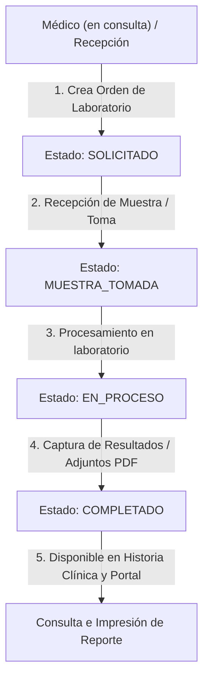

# Diseño: Módulo de Laboratorio Clínico (Órdenes, Resultados y Adjuntos)

> **Documento de Diseño de Arquitectura e Implementación**  
> **Estado:** Propuesto — Pendiente de aprobación.  
> **Objetivo:** Permitir la solicitud de órdenes de laboratorio desde la consulta médica o recepción, el registro estructurado de resultados con valores de referencia, la subida de archivos adjuntos (PDFs/Imágenes) y la generación de reportes impresos.

---

## 1. Alcance y Flujo de Trabajo

El módulo de laboratorio abarca el ciclo completo desde que un médico prescribe un examen hasta que los resultados son capturados, validados e integrados al historial del paciente.



---

## 2. Modelo de Datos (PostgreSQL)

Se proponen 5 tablas para cubrir el catálogo, las órdenes, los detalles, los resultados estructurados y los archivos adjuntos.

```sql
-- 1. Catálogo de pruebas de laboratorio
CREATE TABLE catalogo_laboratorio (
    id            UUID PRIMARY KEY DEFAULT gen_random_uuid(),
    empresa_id    UUID REFERENCES empresas(id) ON DELETE CASCADE, -- NULL = prueba global predefinida
    codigo        TEXT,                                           -- Código interno o LOINC (ej. 'HEM-01')
    nombre        TEXT NOT NULL,                                  -- Ej. 'Hemograma Completo', 'Perfil Lipídico'
    categoria     TEXT NOT NULL,                                  -- Ej. 'Hematología', 'Bioquímica', 'Uroanálisis'
    descripcion   TEXT,
    parametros    JSONB NOT NULL DEFAULT '[]'::jsonb,             -- Lista de parámetros esperados con unidades y rangos ref.
    activo        BOOLEAN NOT NULL DEFAULT true,
    created_at    TIMESTAMPTZ NOT NULL DEFAULT now(),
    updated_at    TIMESTAMPTZ NOT NULL DEFAULT now()
);

CREATE INDEX idx_catalogo_lab_empresa ON catalogo_laboratorio(empresa_id);
CREATE INDEX idx_catalogo_lab_categoria ON catalogo_laboratorio(categoria);

-- 2. Cabecera de Órdenes de Laboratorio
CREATE TABLE ordenes_laboratorio (
    id            UUID PRIMARY KEY DEFAULT gen_random_uuid(),
    empresa_id    UUID NOT NULL REFERENCES empresas(id) ON DELETE CASCADE,
    paciente_id   UUID NOT NULL REFERENCES pacientes(id) ON DELETE CASCADE,
    cita_id       UUID REFERENCES citas(id) ON DELETE SET NULL,     -- Opcional (puede crearse sin cita previa)
    doctor_id     UUID REFERENCES usuarios(id) ON DELETE SET NULL,  -- Médico solicitante
    estado        TEXT NOT NULL DEFAULT 'solicitado',               -- 'solicitado', 'muestra_tomada', 'en_proceso', 'completado', 'cancelado'
    prioridad     TEXT NOT NULL DEFAULT 'normal',                   -- 'normal', 'urgente'
    notas_medicas TEXT,                                             -- Indicaciones o diagnóstico presuntivo
    fecha_orden   TIMESTAMPTZ NOT NULL DEFAULT now(),
    created_at    TIMESTAMPTZ NOT NULL DEFAULT now(),
    updated_at    TIMESTAMPTZ NOT NULL DEFAULT now()
);

CREATE INDEX idx_ordenes_lab_empresa ON ordenes_laboratorio(empresa_id);
CREATE INDEX idx_ordenes_lab_paciente ON ordenes_laboratorio(paciente_id);
CREATE INDEX idx_ordenes_lab_cita ON ordenes_laboratorio(cita_id);
CREATE INDEX idx_ordenes_lab_estado ON ordenes_laboratorio(estado);

-- 3. Detalle de Pruebas solicitadas en una Orden
CREATE TABLE orden_laboratorio_detalles (
    id                      UUID PRIMARY KEY DEFAULT gen_random_uuid(),
    orden_laboratorio_id    UUID NOT NULL REFERENCES ordenes_laboratorio(id) ON DELETE CASCADE,
    catalogo_laboratorio_id UUID NOT NULL REFERENCES catalogo_laboratorio(id) ON DELETE RESTRICT,
    observaciones           TEXT,
    created_at              TIMESTAMPTZ NOT NULL DEFAULT now()
);

CREATE INDEX idx_orden_lab_detalles_orden ON orden_laboratorio_detalles(orden_laboratorio_id);

-- 4. Resultados Específicos por Parámetro
CREATE TABLE resultados_laboratorio (
    id                       UUID PRIMARY KEY DEFAULT gen_random_uuid(),
    orden_detalle_id         UUID NOT NULL REFERENCES orden_laboratorio_detalles(id) ON DELETE CASCADE,
    parametro_nombre         TEXT NOT NULL,                   -- Ej. 'Hemoglobina', 'Leucocitos', 'Glucosa en ayunas'
    resultado_valor          TEXT NOT NULL,                   -- Ej. '14.5', 'Positivo', '105'
    unidad                   TEXT,                            -- Ej. 'g/dL', 'mg/dL', 'x10^3/µL'
    rango_referencia         TEXT,                            -- Ej. '12.0 - 16.0', '< 100'
    es_anormal               BOOLEAN NOT NULL DEFAULT false,  -- Alerta visual si está fuera de rango
    observaciones            TEXT,
    registrado_por           UUID REFERENCES usuarios(id) ON DELETE SET NULL,
    fecha_resultado          TIMESTAMPTZ NOT NULL DEFAULT now(),
    created_at               TIMESTAMPTZ NOT NULL DEFAULT now(),
    updated_at               TIMESTAMPTZ NOT NULL DEFAULT now()
);

CREATE INDEX idx_resultados_lab_detalle ON resultados_laboratorio(orden_detalle_id);

-- 5. Archivos Adjuntos (PDFs de resultados o imágenes de scanner)
CREATE TABLE laboratorio_adjuntos (
    id                      UUID PRIMARY KEY DEFAULT gen_random_uuid(),
    orden_laboratorio_id    UUID NOT NULL REFERENCES ordenes_laboratorio(id) ON DELETE CASCADE,
    nombre_archivo          TEXT NOT NULL,
    mime_type               TEXT NOT NULL DEFAULT 'application/pdf',
    archivo_base64          TEXT NOT NULL,                    -- O URL si se usa storage en la nube en el futuro
    tamano_bytes            INTEGER NOT NULL,
    subido_por              UUID REFERENCES usuarios(id) ON DELETE SET NULL,
    created_at              TIMESTAMPTZ NOT NULL DEFAULT now()
);

CREATE INDEX idx_lab_adjuntos_orden ON laboratorio_adjuntos(orden_laboratorio_id);
```

---

## 3. Formato del Campo JSONB `parametros` en Catálogo

Para facilitar la precarga de plantillas de resultados, la columna `parametros` en `catalogo_laboratorio` guardará una estructura como esta:

```json
[
  {
    "nombre": "Hemoglobina",
    "unidad": "g/dL",
    "rango_referencia": "12.0 - 16.0"
  },
  {
    "nombre": "Hematocrito",
    "unidad": "%",
    "rango_referencia": "36.0 - 48.0"
  },
  {
    "nombre": "Leucocitos",
    "unidad": "x10^3/µL",
    "rango_referencia": "4.5 - 11.0"
  },
  {
    "nombre": "Plaquetas",
    "unidad": "x10^3/µL",
    "rango_referencia": "150 - 450"
  }
]
```

Al agregar una prueba a la orden y pasar a captura de resultados, el sistema auto-generará las filas en `resultados_laboratorio` basándose en esta plantilla, requiriendo solo que el usuario ingrese el `resultado_valor`.

---

## 4. Endpoints API REST Backend (`/api/laboratorio`)

### Catálogo
- `GET /api/laboratorio/catalogo` — Listar pruebas (globales + de la clínica actual).
- `POST /api/laboratorio/catalogo` — Crear nueva prueba en catálogo (`admin`).
- `PUT /api/laboratorio/catalogo/:id` — Actualizar prueba (`admin`).
- `DELETE /api/laboratorio/catalogo/:id` — Desactivar prueba (`admin`).

### Órdenes
- `GET /api/laboratorio/ordenes` — Listar órdenes de la clínica (filtros por `paciente_id`, `cita_id`, `estado`, `fecha`).
- `GET /api/laboratorio/ordenes/:id` — Ver detalle de orden con sus estudios, resultados y adjuntos.
- `POST /api/laboratorio/ordenes` — Crear nueva orden de laboratorio.
- `PUT /api/laboratorio/ordenes/:id/estado` — Cambiar estado (`solicitado` -> `muestra_tomada` -> `en_proceso` -> `completado`).
- `DELETE /api/laboratorio/ordenes/:id` — Cancelar orden.

### Resultados y Adjuntos
- `POST /api/laboratorio/ordenes/:id/resultados` — Registrar o actualizar lote de resultados para una orden.
- `POST /api/laboratorio/ordenes/:id/adjuntos` — Subir archivo adjunto (PDF/Imagen en base64).
- `GET /api/laboratorio/adjuntos/:id` — Obtener/Descargar archivo adjunto.
- `DELETE /api/laboratorio/adjuntos/:id` — Eliminar archivo adjunto.

---

## 5. Módulos e Interfaz en Frontend (Angular 18)

### A. Integración en la Consulta Médica (Ficha de Cita / Historia Clínica)
- Nueva pestaña o sección **"Laboratorio"** en la consulta.
- Botón **"+ Ordenar Exámenes"**: selector múltiple del catálogo de laboratorio con opción de marcar prioridad (`normal` / `urgente`) y agregar notas clínicas.
- Indicador de estado de órdenes asociadas a la cita actual.

### B. Módulo Principal de Laboratorio (Menú de Navegación)
- Nueva opción en menú lateral: **"Laboratorio"** (accesible por `admin`, `doctor`, `recepcionista` / `laboratorista`).
- **Bandeja de Entrada / Dashboard de Órdenes**:
  - Filtros rápidos por estado: `Todas`, `Solicitadas`, `Muestra Tomada`, `En Proceso`, `Completadas`.
  - Distintivo visual para órdenes **Urgentes**.
- **Modal / Formulario de Captura de Resultados**:
  - Carga la plantilla de parámetros predefinidos.
  - Checkbox para marcar valores fuera de rango (`es_anormal`).
  - Campo drag-and-drop para adjuntar PDF de resultados escaneados.

### C. Impresión de Reportes de Resultados
- Plantilla limpia para `window.print()` con:
  - Membrete y logo de la clínica.
  - Datos del paciente (Nombre, Edad, Cédula/ID) y médico solicitante.
  - Tabla de resultados con resaltado para valores anormales.
  - Firma/Nombre del responsable de laboratorio.

---

## 6. Fases de Implementación Sugeridas

| Fase | Alcance | Prioridad |
|---|---|---|
| **Fase 1: Base de Datos y Catálogo** | Migración SQL `007_laboratorio.sql`, seed de catálogo común (Hemograma, Glucosa, Perfil Lipídico, EGO, etc.), CRUD de catálogo en backend. | Alta |
| **Fase 2: Registro de Órdenes y Resultados** | Endpoints de órdenes y resultados en backend, pantalla de creación de órdenes desde la cita y módulo independiente de laboratorio en frontend. | Alta |
| **Fase 3: Adjuntos PDF e Impresión** | Subida de archivos base64 en backend, visualizador/descarga de PDFs y vista de impresión estandarizada. | Media |
| **Fase 4: Integración con Portal del Paciente** | Exposición de órdenes `completadas` en `/api/portal/mis-resultados` para consulta y descarga por parte del paciente. | Media |

---

## 7. Preguntas Abiertas para Decisión del Usuario

1. **Almacenamiento de Adjuntos**: ¿Te parece bien guardar los PDFs en base64 en la base de datos PostgreSQL (igual que avatares/logos actualmente), o prefieres preparar una estructura para guardarlos en disco/storage externo?
2. **Roles de Usuario**: ¿Deseas agregar formalmente un rol `laboratorista` en la tabla de roles de usuario, o por ahora la captura de resultados la realiza el personal existente (`recepcionista` / `doctor` / `admin`)?
